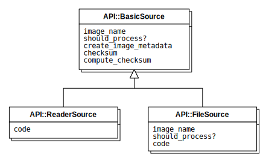

= A test for embedding a SVG image

.Caption for a SVG diagram

You must be add `width` and `height` attributes to the root `<svg>` element to avoid
redundant spaces.

In the above example, I added `width="441.0" height="265.5"`.
